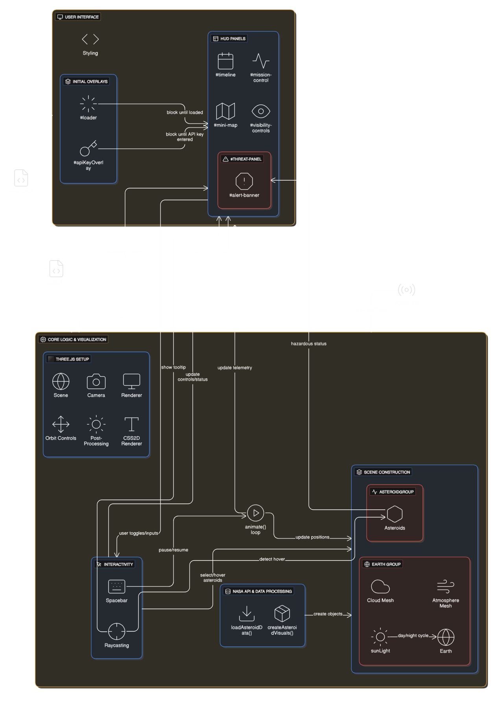

# **Near Earth Objects (NEO) Visualization**

This project is an interactive 3D visualization of Near Earth Objects (asteroids) as they approach Earth. It utilizes the NASA NeoWs (Near Earth Object Web Service) API to fetch real-time data and displays the asteroids' trajectories around a detailed model of the Earth.

## **Features**

* **Real-time Data:** Fetches asteroid data directly from the NASA NeoWs API.  
* **3D Visualization:** Renders Earth, the Moon, a starfield, and asteroids in a 3D space using Three.js.  
* **Realistic Earth Model:** Includes high-resolution day/night textures, cloud layers, and a dynamic atmospheric glow that reacts to the Sun's position.  
* **Interactive Controls:** Users can pan, zoom, and rotate the scene to inspect objects from any angle.  
* **Heads-Up Display (HUD):** A sci-fi inspired interface displays mission-critical information like system time, object counts, and threat assessments.  
* **Object Highlighting:** Potentially hazardous asteroids are visually distinguished from safe ones with different colors and trajectory paths.  
* **Detailed Information:** Hovering over an asteroid or its label displays a tooltip with detailed data, including its name, size, velocity, and miss distance.  
* **Time Control:** Users can pause and resume the simulation.  
* **Filtering:** Ability to toggle the visibility of all, safe, or potentially hazardous asteroids.  
* **Mini-Map:** A 2D radar-style map shows the positions of asteroids relative to Earth.

## **How It Works**

The application is built as a single-page web application.

1. **Initialization:** The index.html file sets up the DOM structure, including the canvas for the 3D scene and all the HUD elements. It then loads the main.js script (or in the case of the user's file, contains the script inline).  
2. **API Key:** On startup, the application prompts the user for a NASA API key. A DEMO\_KEY is provided, but a personal key is recommended for full access. The user also selects the time window (7, 30, or 180 days) for which to fetch asteroid data.  
3. **Data Fetching:** The loadAsteroidData function makes an asynchronous request to the NASA NeoWs API. To handle the API's 7-day limit per request, the total selected duration is broken down into smaller chunks.  
4. **Scene Setup:** While data is loading, Three.js initializes the scene, including the camera, renderer, lighting, and 3D models for the Earth and Moon. High-resolution textures are loaded to create a realistic appearance.  
5. **Asteroid Creation:** Once the API data is received, the createAsteroidVisuals function iterates through each asteroid record. For each one, it creates:  
   * A 3D mesh (an IcosahedronGeometry) representing the asteroid.  
   * A trajectory path (Line) visualized with a Bezier curve.  
   * An HTML-based label (CSS2DObject) for the asteroid's name.  
   * All relevant data (name, diameter, velocity, etc.) is stored in the userData property of the asteroid's mesh for later access.  
6. **Animation Loop:** The animate function runs continuously on every frame. It is responsible for:  
   * Updating the rotation of the Earth and clouds.  
   * Updating the position of the Moon in its orbit.  
   * Moving each asteroid along its pre-calculated trajectory based on the simulation's clock.  
   * Updating the HUD elements with the latest statistics and simulation time.  
   * Rendering the scene, including any post-processing effects like bloom.

## **Setup and Usage**

1. **Get a NASA API Key:** For the best experience, obtain a free API key from [api.nasa.gov](https://api.nasa.gov/).  
2. **Open the Application:** Open the index.html file in a modern web browser.  
3. **Authorize:** When prompted, select the desired data fetch duration (e.g., 7 days) and enter your NASA API key. Click "Initialize Data Link".  
4. **Interact:**  
   * **Mouse:** Click and drag to rotate the camera. Use the scroll wheel to zoom in and out.  
   * **Hover:** Move your mouse over an asteroid to see its details in a tooltip.  
   * **Controls:** Use the visibility buttons on the bottom left to filter which asteroids are displayed.

## **Dependencies**

The project relies on the **Three.js** library and its official add-ons, which are loaded via ES6 module imports from a CDN:

* three: The core 3D library.  
* OrbitControls: For camera manipulation.  
* EffectComposer, RenderPass, UnrealBloomPass: For post-processing effects.  
* CSS2DRenderer: For rendering HTML elements as labels in the 3D scene.

## **File Structure**

The project consists of two main files:

* **index.html**: Contains the HTML structure, CSS styling for the HUD, and the main JavaScript logic within a \<script type="module"\> tag.  
* **main.js**: (In the provided upload, this code is embedded in index.html) Contains all the Three.js setup, API handling, object creation, and animation logic.  
* **/textures/**: (Not provided, but referenced in the code) A directory assumed to contain the image textures for the Earth, Moon, and clouds.

## **Key Functions (main.js)**

* **loadAsteroidData()**: Handles fetching and parsing data from the NASA API.  
* **createAsteroidVisuals()**: Populates the 3D scene with asteroid meshes and their trajectory lines based on the fetched data.  
* **animate()**: The main render loop that updates object positions, rotates the Earth, and renders the scene on each frame.  
* **updateStatistics()**: Updates the HUD with the total, hazardous, and safe asteroid counts.  
* **handleMouseMove()**: Uses raycasting to detect when the mouse is hovering over an asteroid to trigger the tooltip.  
* **updateAsteroidVisibility()**: Filters the asteroids shown on screen based on the user's selections in the control panel.
* 

## **Controls**

* **Left Mouse Button \+ Drag:** Rotate the camera around the central point.  
* **Mouse Wheel:** Zoom in and out.  
* **Right Mouse Button \+ Drag:** Pan the camera.  
* **Spacebar:** Pause/Resume the simulation time.  
* **'R' Key:** Reset the camera to its default position.
